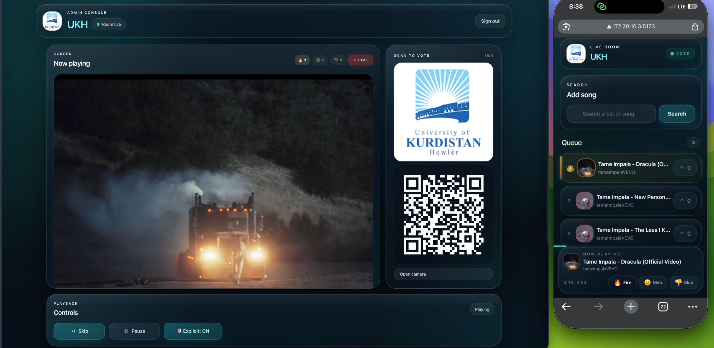
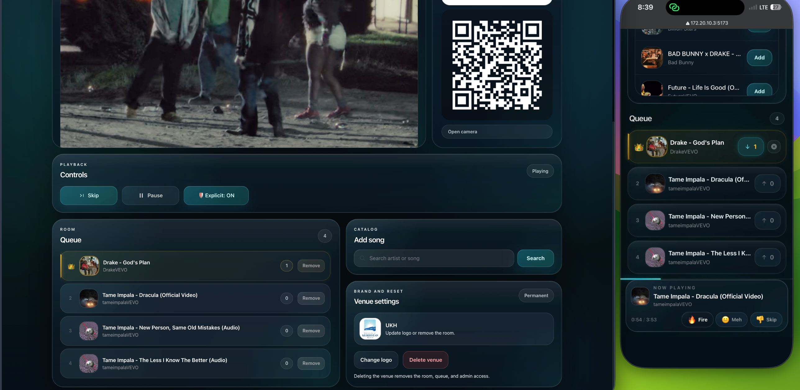

# EchoVote

A real-time, QR-code-based song voting system for public venues. Guests scan a QR code, search YouTube for songs, and vote — the crowd decides what plays next.

Built with a **glass-inspired UI** — translucent panels, ambient gradients, and a music-first layout designed to stay readable on both shared screens and phones.

---

## Preview

**Admin console — live room, now-playing, QR, vote reactions**


**Queue + catalog on desktop, mirrored on the phone in real time**


**Super admin dashboard** _(key-gated, unlinked — screenshot coming)_


---

## Status


**Production-ready**: 153 automated tests (Unit · Integration · WebSocket · EP · BVA · Decision Table · State Transition · API Contract · Concurrency · Security · Error-Path · Socket Reconnection · React Component), hardened auth path, atomic race-safe vote controller, graceful failure handling. See [TESTS.md](./TESTS.md) for the full breakdown.

---

## Table of Contents

- [Overview](#overview)
- [Design](#design)
- [Architecture](#architecture)
- [Tech Stack](#tech-stack)
- [Project Structure](#project-structure)
- [Getting Started](#getting-started)
- [Testing](#testing)
- [Environment Variables](#environment-variables)
- [Docker Services](#docker-services)
- [Two-Factor Authentication](#two-factor-authentication)
- [Venue Image](#venue-image)
- [Database Schemas](#database-schemas)
- [API Reference](#api-reference)
- [Socket.io Events](#socketio-events)
- [Frontend Pages & Components](#frontend-pages--components)
- [Key Implementation Details](#key-implementation-details)
- [Deployment Guide (Free Hosting)](#deployment-guide-free-hosting)

---

## Overview

EchoVote lets venues hand over the playlist to their crowd. The admin registers a venue, displays the QR code (on a TV, tablet, or printed), and guests vote in real time from their phones — no app install required.

**Flow:**
1. Admin registers → sets up 2FA with authenticator app → gets a venue ID + QR code
2. Admin uploads a venue photo from the dashboard
3. Guests scan QR → land on `/venue/:id` (shows venue name and photo)
4. Guests search YouTube, add songs, and vote
5. Server deduplicates votes via browser fingerprint
6. All connected clients update live via Socket.io
7. Admin dashboard controls playback, skip, and filters

---

## Design

EchoVote uses a **glass-inspired** design language with a music-first personality — every detail is built to feel alive, fun, and made for the crowd.

### Glass & Ambient

- **Glass surfaces** — every card, panel, input, and bar uses translucent glass (`backdrop-filter: blur`, `rgba` backgrounds, inner glow borders)
- **Living background** — three animated color blobs (cyan, purple, teal) drift behind the glass, giving every page a breathing, organic feel
- **Teal/Cyan + Purple palette** — primary `#06b6d4` (cyan) with purple accents, gradient text, and glowing highlights
- **No external library** — pure CSS with Tailwind utility classes and custom glass utilities (`glass`, `glass-heavy`, `glass-subtle`, `glass-input`, `glass-button`)

### Personality & Details

- **Crown for #1** — the top-voted song gets a crown and highlighted card
- **Gradient progress bar** — the NowPlaying bar shows live playback progress
- **Pulsing live indicator** — the venue and guest pages surface live status clearly
- **Compact control surfaces** — the admin dashboard keeps video, QR, queue, and playback controls visible without long explanatory copy
- **Phone-first search flow** — guests can search and add songs quickly without extra steps

The design is consistent across all three pages (VenuePage, AdminLogin, AdminDashboard) for a unified premium experience.

---

## Architecture

Monorepo with three top-level directories:

```
echovote/
├── client/          # React frontend (Vite)
├── server/          # Node.js backend (Express + Socket.io)
└── docker-compose.yml
```

The three Docker services (client, server, mongo) communicate over an internal bridge network. MongoDB data is persisted via a named volume.

---

## Tech Stack

| Layer | Technology |
|---|---|
| Frontend | React 18, Vite, Tailwind CSS, React Router v6 |
| Design | Glass-inspired UI (pure CSS — backdrop-filter, glass utilities) |
| Realtime | Socket.io (client + server) |
| Backend | Node.js, Express |
| Database | MongoDB 7 via Mongoose ODM |
| Auth | JWT + bcrypt + TOTP 2FA (speakeasy) |
| Song Search | YouTube Data API v3 |
| Playback | YouTube IFrame Player API |
| Fingerprinting | @fingerprintjs/fingerprintjs |
| QR Codes | qrcode (npm) |
| File Uploads | multer |
| Rate Limiting | express-rate-limit |
| Security Headers | helmet |
| Compression | gzip (nginx + express-compression) |
| Production Web | nginx (multi-stage client build, gzip, long-lived asset caching) |
| Containerization | Docker + Docker Compose |

---

## Project Structure

```
echovote/
├── docker-compose.yml
├── .env.example
├── client/
│   ├── Dockerfile
│   ├── package.json
│   ├── vite.config.js
│   ├── tailwind.config.js
│   ├── postcss.config.js
│   ├── index.html
│   └── src/
│       ├── main.jsx
│       ├── App.jsx
│       ├── index.css              # Glass utilities + ambient blob animations
│       ├── pages/
│       │   ├── VenuePage.jsx        # Guest voting UI (/venue/:id)
│       │   ├── AdminLogin.jsx       # Admin login + registration + 2FA setup
│       │   └── AdminDashboard.jsx   # Admin control panel + venue image
│       ├── components/
│       │   ├── SongCard.jsx         # Single queue entry with vote button
│       │   ├── VoteButton.jsx       # Upvote button with voted state
│       │   ├── SearchBar.jsx        # YouTube search + add to queue
│       │   ├── Leaderboard.jsx      # Ranked queue list
│       │   ├── NowPlaying.jsx       # Fixed bottom bar showing current song
│       │   └── QRDisplay.jsx        # QR code image from API
│       ├── hooks/
│       │   ├── useSocket.js         # Socket.io connection + event binding
│       │   └── useVenue.js          # Queue state + real-time sync
│       └── services/
│           ├── api.js               # Axios instance + all API calls
│           └── socket.js            # Socket.io singleton
└── server/
    ├── Dockerfile
    ├── package.json
    ├── uploads/                     # Venue images (served statically)
    └── src/
        ├─�� index.js                 # App entry: Express + Socket.io + DB
        ├── config/
        │   ├── db.js                # Mongoose connection
        │   └── env.js               # Centralised env vars
        ├── models/
        │   ├── Venue.js             # + image field
        │   ├── Song.js
        │   ├── ActiveQueue.js
        │   ├─��� PlaybackState.js
        │   └── Admin.js             # + twoFactorSecret, twoFactorEnabled
        ├── routes/
        │   ├── auth.js              # Login, register, 2FA setup + verify
        │   ├── songs.js             # GET|POST /api/songs/:venueId, GET search
        │   ├── votes.js             # POST /api/votes/:songId
        │   ├── admin.js             # Admin controls + venue image upload
        │   └── qr.js                # GET /api/qr/:venueId
        ├── middleware/
        │   ├── auth.js              # JWT Bearer token verification
        │   └── rateLimiter.js       # 10 votes/min per IP
        ├── services/
        │   ├── youtubeService.js    # YouTube Data API v3 search
        │   ├── socketManager.js     # Global io singleton + emitToVenue helper
        │   └── voteController.js    # Fingerprint dedup + vote broadcast
        └── socket/
            └── handlers.js          # join_venue + reactions + authenticated playback progress
```

---

## Getting Started

### Prerequisites

- [Docker](https://www.docker.com/) and Docker Compose
- A [YouTube Data API v3](https://console.cloud.google.com/) key

### 1. Clone and configure

```bash
git clone https://github.com/Chenarrr/Echovote-Project-.git
cd Echovote-Project-
cp .env.example .env
```

Edit `.env` and fill in your values:

```
JWT_SECRET=some_long_random_string
YOUTUBE_API_KEY=your_api_key_here

MONGO_INITDB_ROOT_USERNAME=your_mongo_username
MONGO_INITDB_ROOT_PASSWORD=your_mongo_password
MONGO_INITDB_DATABASE=echovote

VITE_API_URL=http://localhost:3001
VITE_SOCKET_URL=http://localhost:3001
CLIENT_ORIGIN=http://localhost:5173

# Optional — enables the /super-admin dashboard
SUPER_ADMIN_KEY=some_long_random_string
```

Generate secure values:
```bash
# JWT secret / super admin key
openssl rand -base64 32

# MongoDB password
openssl rand -base64 24 | tr -d '=/+' | head -c 32
```

### 2. Start all services

```bash
docker compose up --build
```

| Service | URL |
|---|---|
| Client (React) | http://localhost:5173 |
| Server (API) | http://localhost:3001 |
| MongoDB | localhost:27017 |

### 3. Register an admin account

1. Go to `http://localhost:5173/admin/login`
2. Switch to **Register** and fill in venue name, email, password
3. Scan the 2FA QR code with your authenticator app (Google Authenticator, Authy, etc.)
4. Enter the 6-digit code to complete setup

### 4. Set up your venue

From the admin dashboard:
- Upload a venue photo (shown to guests on the voting page)
- Display the QR code on a screen, projector, or print it

### 5. Share with guests

Guests scan the QR code from their phone and land on the voting page — no app install needed.

---

## Testing

EchoVote ships with a **153-test automated suite** covering every layer from individual functions to full user flows. See [TESTS.md](./TESTS.md) for the per-test breakdown, categories, and full rationale.

### Test matrix

| Layer                       | Tool                                     | Count | Runtime | Status  |
|-----------------------------|------------------------------------------|-------|---------|---------|
| Unit                        | Jest 30                                  | 26    | < 1s    | PASS    |
| API Integration             | Jest + Supertest + mongodb-memory-server | 24    | ~4s     | PASS    |
| WebSocket                   | Real Socket.IO server + client           | 6     | ~1s     | PASS    |
| Equivalence Partitioning    | Jest + Supertest                         | 18    | ~1s     | PASS    |
| Boundary Value Analysis     | Jest + express-rate-limit                | 14    | ~1s     | PASS    |
| Decision Table              | Jest + mocked rate limiter state         | 8     | ~1s     | PASS    |
| State Transition (auth FSM) | Jest + real TOTP via speakeasy           | 11    | ~9s     | PASS    |
| API Contract                | Jest + Supertest                         | 16    | ~4s     | PASS    |
| Concurrency / Race          | Jest + `Promise.all(...)`                | 3     | < 1s    | PASS    |
| Security / Negative Auth    | Jest + forged JWTs                       | 6     | ~1s     | PASS    |
| Error Paths                 | Jest + mocked failures                   | 6     | ~1s     | PASS    |
| Socket Reconnection         | Real Socket.IO + forced disconnect       | 3     | ~1s     | PASS    |
| React Component             | Vitest 2 + React Testing Library + jsdom | 12    | ~1s     | PASS    |
| End-to-End (browser)        | Cypress 15                               | 8     | manual  | WRITTEN |
| **Executed total**          |                                          | **153** | **~37s** | **PASS** |

### Commands

```bash
# Server test suite (141 Jest tests)
cd server
npm test                                    # all tests, sequential
npx jest __tests__/unit --runInBand         # just unit
npx jest __tests__/race --runInBand         # just concurrency/race

# Client component tests (12 Vitest + RTL)
cd client
npm test                                    # one-shot
npm run test:watch                          # watch mode

# End-to-end browser tests (8 Cypress specs, manual)
# Terminal 1 — start the Vite dev server
cd client && npm run dev
# Terminal 2 — run Cypress headless
cd client && npx cypress run
# Or interactive
cd client && npx cypress open
```

### What the tests guarantee

- **Atomic, race-safe voting.** `voteController.castVote` and `undoVote` use a conditional `findOneAndUpdate` so 10 concurrent voters on the same song produce exactly 10 distinct fingerprints and `voteCount === voterFingerprints.length` — no dropped votes under load. Verified by `RACE-01`/`RACE-02`.
- **Hardened admin auth.** Every JWT failure mode (expired, tampered, missing prefix, wrong secret, garbage token) returns 401. Login does not leak whether an email is registered. Cross-venue token reuse cannot mutate another venue's queue. Verified by `SEC-01`..`SEC-06`.
- **Real TOTP-backed 2FA flow.** The full auth FSM (UNAUTHENTICATED → PASSWORD_VERIFIED → AUTHENTICATED, with REJECTED and recovery) is exercised end-to-end using real `speakeasy`-generated TOTP codes against the real endpoints. Verified by `STT-01`..`STT-11`.
- **Graceful failure under ugly weather.** YouTube API 500s, malformed JSON bodies, oversized payloads, invalid ObjectIds, and mid-request DB failures all produce structured error responses without crashing the process. A second request after a simulated DB failure still succeeds. Verified by `ERR-01`..`ERR-06`.
- **Flaky-wifi resilience.** Clients auto-reconnect after forced disconnect, and the "must re-join room after reconnect" contract is locked in. Verified by `SR-01`..`SR-03`.
- **Every public endpoint honours its contract.** All 16 documented endpoints have an assertion on status code + response shape, so refactor drift (e.g. a 403 silently becoming a 400) is caught immediately. Verified by `API-01`..`API-16`.
- **No flaky network calls in tests.** `axios` is mocked for YouTube search, `socketManager` is mocked wherever sockets aren't the subject under test, and `mongodb-memory-server` gives every test a fresh in-memory Mongo. Tests are deterministic and CI-friendly.

### Test philosophy

1. **Real code paths over mocks whenever practical.** Integration tests use real Mongoose models against an in-memory Mongo, real `bcryptjs` hashing, real `speakeasy` TOTP, and real `jsonwebtoken` signing/verifying. Mocks are reserved for external APIs (YouTube) and side channels (sockets) that would slow tests or make them flaky.
2. **One property per test.** Every test name is a claim; every assertion verifies that exact claim. No kitchen-sink tests.
3. **Honest pass/fail only.** Nothing is skipped, silenced, or wrapped in `try/catch` to hide failures. The 8 Cypress specs that are *written but not executed* are clearly flagged as such — see [TESTS.md §5](./TESTS.md).
4. **Race + security + error-path suites are first-class citizens**, not afterthoughts. A venue app is a multi-user system and must survive concurrent requests and adversarial input.

---

## Environment Variables

| Variable | Required | Description |
|---|---|---|
| `JWT_SECRET` | Yes | Secret key for signing JWTs. Required outside test runs; the server refuses to start without it. |
| `YOUTUBE_API_KEY` | Yes | YouTube Data API v3 key |
| `MONGO_INITDB_ROOT_USERNAME` | Yes | MongoDB root username |
| `MONGO_INITDB_ROOT_PASSWORD` | Yes | MongoDB root password |
| `MONGO_INITDB_DATABASE` | Yes | MongoDB database name (use `echovote`) |
| `PORT` | No | Server port (default: `3001`) |
| `CLIENT_ORIGIN` | No | CORS allowed origin (default: `http://localhost:5173`) |
| `NODE_ENV` | No | `development` or `production` |
| `SUPER_ADMIN_KEY` | No | Access key for the `/super-admin` dashboard. If unset, the dashboard is disabled (503). Generate with `openssl rand -base64 32`. |

Client-side (set in docker-compose or `.env`):

| Variable | Description |
|---|---|
| `VITE_API_URL` | Backend base URL (default: `http://localhost:3001`) |
| `VITE_SOCKET_URL` | Socket.io server URL (default: `http://localhost:3001`) |

---

## Docker Services

Defined in `docker-compose.yml`:

### `mongo`
- Image: `mongo:7`
- Port: `127.0.0.1:27017` (bound to localhost only — not reachable from outside)
- Auth: username + password via `MONGO_INITDB_ROOT_USERNAME` / `MONGO_INITDB_ROOT_PASSWORD`
- Volume: `mongo_data` (persistent)

### `server`
- Built from `./server/Dockerfile`
- Port: `3001`
- Depends on `mongo`
- Serves uploaded images from `/uploads` statically

### `client`
- Built from `./client/Dockerfile` (multi-stage: Node builder → nginx runtime)
- Port: `5173` (nginx serves the prebuilt Vite bundle on port 80 internally)
- nginx config: gzip compression, 1-year cache for hashed assets, `no-cache` for `index.html`, SPA fallback via `try_files`
- `VITE_API_URL` / `VITE_SOCKET_URL` are injected at **build time** as Docker build args
- Depends on `server`

---

## Two-Factor Authentication

EchoVote uses TOTP (Time-based One-Time Password) for admin security.

**Setup flow (on registration):**
1. Server generates a TOTP secret using `speakeasy`
2. Server returns the QR code, manual entry secret, and a short-lived `setupToken`
3. Client displays the QR code for the authenticator app
4. Admin scans the QR and enters the 6-digit code together with the `setupToken`
5. Once verified, 2FA is permanently enabled for that account and the JWT is issued

**Login flow:**
1. Admin enters email + password
2. If 2FA is enabled, server responds with `{ requires2FA: true }`
3. Client shows the TOTP input screen
4. Admin enters the 6-digit code from their authenticator
5. Server verifies and issues a JWT

Supported apps: Google Authenticator, Authy, 1Password, Microsoft Authenticator, or any TOTP-compatible app.

---

## Venue Image

Admins can upload a venue photo (JPG/PNG/GIF/WebP, max 5MB) from the dashboard.

- Stored on disk in `server/uploads/`
- Served statically at `/uploads/<filename>`
- Displayed in the dashboard header and on the guest voting page
- Helps guests confirm they're voting for the right venue
- Validated by file signature before saving
- Saved with a server-generated filename instead of the original upload name

---

## Database Management

You can manage the database directly via the MongoDB shell inside Docker.

### Connect to the database

```bash
docker exec -it echovote_mongo mongosh -u "$MONGO_INITDB_ROOT_USERNAME" -p "$MONGO_INITDB_ROOT_PASSWORD" --authenticationDatabase admin echovote
```

### View data

```js
// List all admins
db.admins.find().pretty()

// List all venues
db.venues.find().pretty()

// List all songs in a venue's queue
db.activequeues.find({ venueId: ObjectId("VENUE_ID_HERE") }).pretty()

// List all songs
db.songs.find().pretty()
```

### Delete data

> **Note:** The `Venue` model has a cascading delete hook — when a venue is deleted via the app's API, its linked admin is automatically deleted too. When deleting directly in mongosh, the hook does **not** fire, so you must delete both manually.

```js
// Delete a venue and its admin (mongosh — do both manually)
db.venues.deleteOne({ name: "My Venue" })
db.admins.deleteOne({ email: "admin@example.com" })

// Delete a specific admin by email only
db.admins.deleteOne({ email: "user@example.com" })

// Delete all admins
db.admins.deleteMany({})

// Delete all venues
db.venues.deleteMany({})

// Clear all queues (remove all songs from all venues)
db.activequeues.deleteMany({})

// Full reset (wipe everything)
db.admins.deleteMany({})
db.venues.deleteMany({})
db.songs.deleteMany({})
db.activequeues.deleteMany({})
db.playbackstates.deleteMany({})
```

### Edit data

```js
// Change a venue's name
db.venues.updateOne(
  { _id: ObjectId("VENUE_ID_HERE") },
  { $set: { name: "New Venue Name" } }
)

// Change an admin's email
db.admins.updateOne(
  { email: "old@example.com" },
  { $set: { email: "new@example.com" } }
)

// Disable 2FA for an admin (if locked out)
db.admins.updateOne(
  { email: "user@example.com" },
  { $set: { twoFactorEnabled: false, twoFactorSecret: null } }
)

// Toggle explicit filter for a venue
db.venues.updateOne(
  { _id: ObjectId("VENUE_ID_HERE") },
  { $set: { "settings.explicitFilter": true } }
)
```

### Useful queries

```js
// Count total votes across all queues
db.activequeues.aggregate([{ $group: { _id: null, total: { $sum: "$voteCount" } } }])

// Find the most voted song
db.activequeues.find().sort({ voteCount: -1 }).limit(1).pretty()

// See which admin owns which venue
db.admins.aggregate([
  { $lookup: { from: "venues", localField: "venueId", foreignField: "_id", as: "venue" } },
  { $unwind: "$venue" },
  { $project: { email: 1, "venue.name": 1 } }
])
```

> **Tip:** You can also use [MongoDB Compass](https://www.mongodb.com/products/compass) (GUI) — connect to `mongodb://<MONGO_INITDB_ROOT_USERNAME>:<MONGO_INITDB_ROOT_PASSWORD>@localhost:27017/?authSource=admin` and browse/edit the `echovote` database visually.

---

## Database Schemas

### Venue
```js
{
  name: String,
  qrCodeSecret: String,
  image: String,              // path to uploaded venue photo
  settings: {
    explicitFilter: Boolean,
    weeklySeeds: [String],
  }
}
```

### Song
```js
{
  youtubeId: String,
  title: String,
  thumbnail: String,
  artist: String,
  voteCount: Number,
  addedBy: String,
  isExplicit: Boolean,
  venueId: ObjectId → Venue
}
```

### ActiveQueue
```js
{
  songId: ObjectId → Song,
  voteCount: Number,
  timestamp: Date,
  voterFingerprints: [String],
  venueId: ObjectId → Venue
}
```

### PlaybackState
```js
{
  venueId: ObjectId → Venue,
  currentSongId: ObjectId → Song,
  progress: Number,
  isPlaying: Boolean
}
```

### Admin
```js
{
  email: String,
  passwordHash: String,
  venueId: ObjectId → Venue,
  twoFactorSecret: String,    // TOTP base32 secret
  twoFactorEnabled: Boolean    // true after initial setup verified
}
```

---

## API Reference

### Auth

| Method | Endpoint | Body | Description |
|---|---|---|---|
| POST | `/api/auth/register` | `{ email, password, venueName }` | Create admin + venue, returns 2FA setup QR, secret, and `setupToken` |
| POST | `/api/auth/verify-2fa-setup` | `{ setupToken, token }` | Verify TOTP code and enable 2FA, returns JWT |
| POST | `/api/auth/login` | `{ email, password, totpCode? }` | Login; returns `{ requires2FA: true }` if 2FA enabled and no code provided |

### Songs

| Method | Endpoint | Params / Body | Description |
|---|---|---|---|
| GET | `/api/songs/search` | `?q=<query>` | Search YouTube Data API v3 (rate-limited to 20/min per IP) |
| GET | `/api/songs/:venueId` | — | Get active queue sorted by votes desc |
| POST | `/api/songs/:venueId` | `{ youtubeId, title, thumbnail, artist, addedBy, isExplicit? }` | Add song to queue (blocked if explicit filter ON; max 2 per fingerprint) |
| DELETE | `/api/songs/:venueId/:songId` | `{ fingerprint }` | Guest removes their own song (must match `addedBy`) |

### Votes

| Method | Endpoint | Body | Description |
|---|---|---|---|
| POST | `/api/votes/:songId` | `{ visitorFingerprint }` | Cast a vote; rate-limited to 10/min per IP |
| DELETE | `/api/votes/:songId` | `{ visitorFingerprint }` | Undo a vote |

Returns `409` if fingerprint already voted for that song.

### Venue (public)

| Method | Endpoint | Description |
|---|---|---|
| GET | `/api/venue/:venueId` | Returns venue name and image (no auth required) |

### Admin _(all require `Authorization: Bearer <token>`)_

| Method | Endpoint | Body | Description |
|---|---|---|---|
| POST | `/api/admin/skip` | — | Remove current song, advance to next highest voted |
| POST | `/api/admin/pause` | — | Toggle `isPlaying` on PlaybackState |
| POST | `/api/admin/filter` | — | Toggle `explicitFilter` on venue settings |
| POST | `/api/admin/play-now` | `{ youtubeId, title, thumbnail, artist }` | Play a song immediately, bypassing the queue |
| DELETE | `/api/admin/queue/:songId` | — | Remove any song from the queue |
| POST | `/api/admin/venue-image` | `multipart/form-data` with `image` field | Upload venue photo (JPG/PNG/GIF/WebP, max 5MB, validated by file signature) |
| GET | `/api/admin/venue` | — | Get full venue details plus current `playbackState` for the authenticated admin |
| DELETE | `/api/admin/venue` | — | Delete venue, admin account, all songs, and queue (irreversible) |

### QR

| Method | Endpoint | Description |
|---|---|---|
| GET | `/api/qr/:venueId` | Returns a 300x300 PNG QR code pointing to `/venue/:venueId` |

### Super Admin _(protected by `SUPER_ADMIN_KEY` — not a JWT)_

| Method | Endpoint | Headers | Description |
|---|---|---|---|
| POST | `/api/super-admin/stats` | `X-Super-Admin-Key: <SUPER_ADMIN_KEY>` | Returns platform-wide counts (admins, venues, unique users, songs) and per-venue stats. Rate-limited to **1 failed attempt per minute per IP** (successful unlocks don't consume the budget). Key comparison is timing-safe on padded buffers, the key must be ≥32 chars, and every attempt is audit-logged. |

### Health

| Method | Endpoint | Description |
|---|---|---|
| GET | `/health` | Returns `{ status: "ok" }` |

---

## Socket.io Events

All events are scoped to a venue room (`venue:<venueId>`). Clients join by emitting `join_venue`.

### Client → Server

| Event | Payload | Description |
|---|---|---|
| `join_venue` | `{ venueId }` | Join the venue's Socket.io room |
| `cast_vote` | `{ songId, fingerprint, venueId }` | Disabled intentionally; server replies with `vote_error` and voting must go through the HTTP API |
| `progress_update` | `{ venueId, currentTime, duration, token }` | Sent by the admin dashboard every second with current playback position and admin JWT |
| `song_reaction` | `{ venueId, reaction, fingerprint }` | Guest reacts to the current song (fire, meh, dislike) |

### Server → All clients in venue room

| Event | Payload | Description |
|---|---|---|
| `update_tally` | `{ songId, newCount }` | A single song's vote count changed |
| `queue_updated` | `{ queue }` | Full sorted queue (after add or vote) |
| `now_playing` | `{ song }` | Current song changed (skip or auto-advance) |
| `playback_state` | `{ isPlaying }` | Pause/resume toggled by admin |
| `playback_progress` | `{ currentTime, duration }` | Current playback position (forwarded from admin to all guests every second) |
| `reaction_update` | `{ reaction, fingerprint }` | Broadcasted to venue room when a guest reacts to the current song |
| `vote_error` | `{ error }` | Emitted back to voter socket on failure |
| `progress_error` | `{ error }` | Emitted back to the sender if a progress update is missing a valid admin token |

---

## Frontend Pages & Components

### Pages

**`/venue/:id` — VenuePage**
Guest-facing page. Shows venue name and photo in the header. Loads fingerprint on mount, fetches the queue, listens for real-time updates. Supports searching YouTube and adding songs (max 2 per guest). Guests can remove their own songs from the queue.

**`/admin/login` — AdminLogin**
Three-step flow: credentials → 2FA setup (on register) or 2FA verification (on login) → dashboard redirect.

**`/super-admin` — SuperAdmin**
Private, key-gated dashboard (not linked from anywhere). Enter the `SUPER_ADMIN_KEY` value to see total admins, venues, unique users, and per-venue stats (admins, 2FA-enabled admins, queued songs, unique users). The key is sent via `X-Super-Admin-Key` header (never in the URL or request body), compared with `crypto.timingSafeEqual` on padded buffers, required to be ≥32 characters, and rate-limited to **1 failed attempt per minute** per IP. Every attempt is audit-logged.

**`/admin/dashboard` — AdminDashboard**
Admin control panel with:
- TV-friendly top bar and compact venue controls
- YouTube IFrame Player with persisted playback state and auto-skip on song end
- Live queue with real-time vote counts
- QR code display for the room
- Controls for skip, pause/resume, explicit filter (ON/OFF)
- Admin song search with "Play" and "Queue" actions
- Delete button on each queue entry to remove any song
- Venue delete action with confirmation

### Components

| Component | Description |
|---|---|
| `SongCard` | Displays rank, thumbnail, title, artist, vote button, and delete button (for own songs) |
| `VoteButton` | Upvote toggle; click to vote, click again to undo |
| `SearchBar` | YouTube search with compact inline results and Add button |
| `Leaderboard` | Ranked queue list with song count |
| `NowPlaying` | Fixed bottom bar with progress bar, elapsed/total time, and reactions |
| `QRDisplay` | Compact QR code panel for guest access |

### Hooks

**`useSocket(venueId, handlers)`**
Connects to Socket.io, joins the venue room, and binds/unbinds event handlers automatically on mount/unmount.

**`useVenue(venueId)`**
Fetches the initial queue via REST, then keeps it in sync via `queue_updated`, `update_tally`, `now_playing`, and `playback_progress` socket events. Returns `{ queue, nowPlaying, playbackProgress, loading, refetch }`.

---

## Key Implementation Details

**Two-factor authentication**
Admin accounts are protected with TOTP 2FA. The secret is generated during registration using `speakeasy`, and the admin verifies it with their authenticator app before the account is fully activated. Registration returns a short-lived `setupToken`, and no admin JWT is issued until that setup token and TOTP code are verified together. Login requires both password and TOTP code.

**Venue branding**
Each venue can upload a photo that is displayed on both the admin dashboard and the guest voting page, making the experience feel tailored to the specific location. Uploads are validated against the real file bytes before saving, and files are stored on disk in `server/uploads/` with a server-generated filename. This works fine locally via Docker volumes, but before deploying to production (Render, Fly.io, etc.) you should migrate to cloud storage (e.g. Cloudinary) since hosted filesystems are ephemeral and reset on every deploy.

**Explicit content filter**
When enabled, the server blocks explicit songs from being added to the queue. YouTube search results include an `isExplicit` flag derived from YouTube's `contentRating.ytRating` (age-restricted content). The admin toggles the filter from the dashboard — the button shows ON/OFF state. Explicit songs are marked with an `E` badge in search results.

**Admin direct playback**
Admins can search for songs and play them immediately via the "Play" action, bypassing the queue. The queue remains untouched — queued songs play in order after the admin's pick finishes or is skipped.

**Live playback progress**
The admin dashboard emits the YouTube player's current time and duration every second via socket (`progress_update`). Each progress update includes the admin JWT, and the server verifies that token before forwarding `playback_progress` to guests in the same venue room. The guest NowPlaying bar displays a progress bar and elapsed/total time.

**Song limit per guest**
Each guest can add a maximum of 2 songs to the queue (tracked by browser fingerprint via `addedBy`). Guests can remove their own songs to free up a slot. Admins can remove any song.

**Voting with undo (race-safe)**
Each `ActiveQueue` document stores a `voterFingerprints` array. Voting and undoing both use a single atomic Mongo operation — `findOneAndUpdate` with a conditional filter (`voterFingerprints: { $ne: fingerprint }` for cast, `voterFingerprints: fingerprint` for undo) and a `$push`/`$pull` + `$inc` update — so concurrent voters on the same song never lose votes or end up with `voteCount` out of sync with `voterFingerprints.length`. The vote button toggles between voted/unvoted states client-side. Fingerprints are generated with `@fingerprintjs/fingerprintjs`.

**Audience reactions**
Guests can react to the currently playing song with one of three emojis: fire (love it), meh, or dislike. Reactions are sent via socket and displayed live on the admin dashboard as counts. Counts reset when the song changes. This helps the admin decide whether to skip a track.

**Real-time updates**
All clients join a Socket.io room keyed by venue ID. Every vote, song add, or skip broadcasts to the entire room so every open browser tab updates instantly.

**Socket voting is disabled**
Votes are accepted only through the HTTP vote API so they always pass through the same validation and rate-limiting path. Any client that tries to vote over Socket.io receives a `vote_error` response instead.

**Auto-advance playback**
The YouTube IFrame Player's `onStateChange` fires when a video ends (`YT.PlayerState.ENDED`). The admin dashboard calls `POST /api/admin/skip` automatically, which removes the current song from the queue, picks the next highest-voted, and broadcasts `now_playing` to all clients.

**JWT flow**
- Stored in `localStorage` as `echovote_token`
- Axios interceptor in `api.js` attaches it as `Authorization: Bearer <token>` on every request
- Server middleware in `auth.js` verifies and decodes it, attaching `req.admin` with `{ adminId, venueId }`

**Rate limiting**
`express-rate-limit` is applied to:
- Global — max 300 requests per minute per IP (catch-all floor)
- `POST /api/votes/:songId` — max 10 requests per minute per IP
- Auth endpoints — max 20 attempts per 15 minutes per IP
- `GET /api/songs/search` — max 20 requests per minute per IP
- `POST /api/super-admin/*` — **max 1 failed attempt per minute per IP** (successful requests don't consume the budget)

**Security hardening**
- MongoDB binds to `127.0.0.1` only — not reachable from outside the host
- Root DB auth required (username + password via `.env`, never committed)
- `helmet` sets strict security headers: HSTS (1 yr, `includeSubDomains`, `preload`), `Referrer-Policy: no-referrer`, `X-Content-Type-Options: nosniff`, `X-Frame-Options: DENY`
- `express-mongo-sanitize` strips `$` and `.` from request payloads (blocks NoSQL operator injection)
- `hpp` removes duplicate query parameters (blocks HTTP Parameter Pollution)
- `express.json({ limit: '200kb' })` caps payload size to stop large-body DoS
- `x-powered-by` header disabled; `trust proxy: 1` so rate limits use the real client IP behind nginx
- CORS allowlist is a strict callback (null origin for curl is allowed, everything else is rejected — no wildcard)
- JWT is required for every admin mutation; refuses to boot without `JWT_SECRET`
- TOTP 2FA is mandatory on admin accounts (cannot be disabled from the UI)
- **Super admin:**
  - Key must be ≥ 32 characters or the endpoint refuses to serve (503). Short keys are logged as a startup warning, never accepted
  - Key is compared with `crypto.timingSafeEqual` on **padded buffers**, so the comparison leaks no information about the correct key length or prefix
  - Key is only read from the `X-Super-Admin-Key` header — never from the URL or body (so it never appears in access logs)
  - Every granted AND denied attempt is audit-logged with IP + user-agent
- File uploads are validated against real file bytes (not just the extension) and renamed to a server-generated name
- Static `/uploads` served with `X-Content-Type-Options: nosniff` and a 7-day cache

**Performance**
- Client is served by **nginx** from a multi-stage Docker build (not the Vite dev server). Bundle is gzipped, hashed assets are cached for a year, and `index.html` is served `no-cache` so deploys always pick up the new hashes.
- Server responses pass through `compression()` (gzip) for JSON and text payloads.
- Socket.io still runs on the same Express server — no extra hops.
- Result in practice: the first load is typically a single-digit number of kilobytes for hashed JS/CSS and cached on repeat visits, so navigating between pages is effectively instant.

---

## Deployment Guide (Free Hosting)

You can deploy EchoVote for free using these services:

### Option 1: Render (Server) + Vercel (Client) + MongoDB Atlas (DB)

This is the recommended free stack.

#### Step 1: MongoDB Atlas (free 512MB cluster)

1. Go to [mongodb.com/atlas](https://www.mongodb.com/atlas) and create a free account
2. Create a free shared cluster (M0)
3. Create a database user with a password
4. Whitelist `0.0.0.0/0` for IP access (or specific IPs)
5. Copy the connection string: `mongodb+srv://<user>:<password>@cluster0.xxxxx.mongodb.net/echovote`

#### Step 2: Deploy the server on Render

1. Go to [render.com](https://render.com) and sign in with GitHub
2. Click **New** → **Web Service**
3. Connect your GitHub repo
4. Configure:
   - **Root Directory**: `server`
   - **Build Command**: `npm install`
   - **Start Command**: `node src/index.js`
   - **Instance Type**: Free
5. Add environment variables:
   - `MONGO_URI` = your Atlas connection string
   - `JWT_SECRET` = your secret
   - `YOUTUBE_API_KEY` = your API key
   - `CLIENT_ORIGIN` = your Vercel URL (set after deploying client)
   - `NODE_ENV` = `production`
6. Deploy — note the Render URL (e.g. `https://echovote-server.onrender.com`)

#### Step 3: Deploy the client on Vercel

1. Go to [vercel.com](https://vercel.com) and sign in with GitHub
2. Click **Add New** → **Project**
3. Import your GitHub repo
4. Configure:
   - **Root Directory**: `client`
   - **Framework Preset**: Vite
   - **Build Command**: `npm run build`
   - **Output Directory**: `dist`
5. Add environment variables:
   - `VITE_API_URL` = your Render server URL
   - `VITE_SOCKET_URL` = your Render server URL
6. Deploy — note the Vercel URL (e.g. `https://echovote.vercel.app`)
7. Go back to Render and update `CLIENT_ORIGIN` to your Vercel URL

#### Step 4: Update CORS

Once both are deployed, make sure `CLIENT_ORIGIN` on Render matches your Vercel domain exactly.

### Option 2: Fly.io (full stack)

1. Install the Fly CLI: `curl -L https://fly.io/install.sh | sh`
2. Create a Fly account and run `fly auth login`
3. Deploy the server:
   ```bash
   cd server
   fly launch --name echovote-server
   fly secrets set JWT_SECRET=... YOUTUBE_API_KEY=... MONGO_URI=... CLIENT_ORIGIN=...
   fly deploy
   ```
4. Deploy the client similarly, or host it on Vercel/Netlify

### Cost comparison

| Service | Free tier | Notes |
|---|---|---|
| **MongoDB Atlas** | 512MB M0 cluster | More than enough for most venues |
| **Render** | 750 hours/month | Spins down after 15min inactivity, ~30s cold start |
| **Vercel** | Unlimited static deploys | Perfect for the React client |
| **Fly.io** | 3 shared VMs, 160GB bandwidth | Always-on, no cold start |

For a venue app that needs to stay responsive during events, consider Fly.io (server) + Vercel (client) + Atlas (DB). For hobby/testing, Render + Vercel + Atlas is completely free.

### Sharing with friends

Once deployed, just share the Vercel URL. They can register their own venue and start using it immediately. The QR code will automatically point to the correct production URL.

### QR code URLs

The QR code is generated using `VITE_API_URL`, so it must be set correctly for guests to scan it.

| Environment | What to set |
|---|---|
| **Local (same WiFi)** | `VITE_API_URL=http://192.168.x.x:3001` (your machine's local IP — run `ipconfig getifaddr en0` to find it) |
| **Production** | `VITE_API_URL=https://your-server.onrender.com` |

In production, also make sure these are set:
```
VITE_API_URL=https://your-server.onrender.com
VITE_SOCKET_URL=https://your-server.onrender.com
CLIENT_ORIGIN=https://your-app.vercel.app
```

Once set correctly, the QR code works from any phone on any network — no same-WiFi requirement.
ent.
